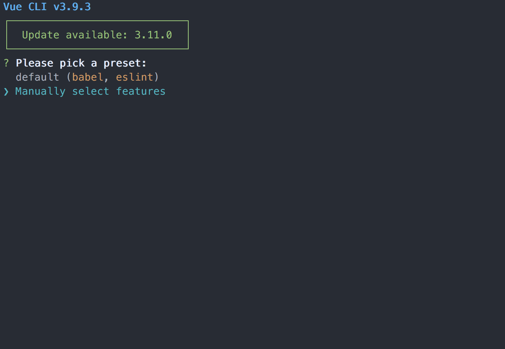
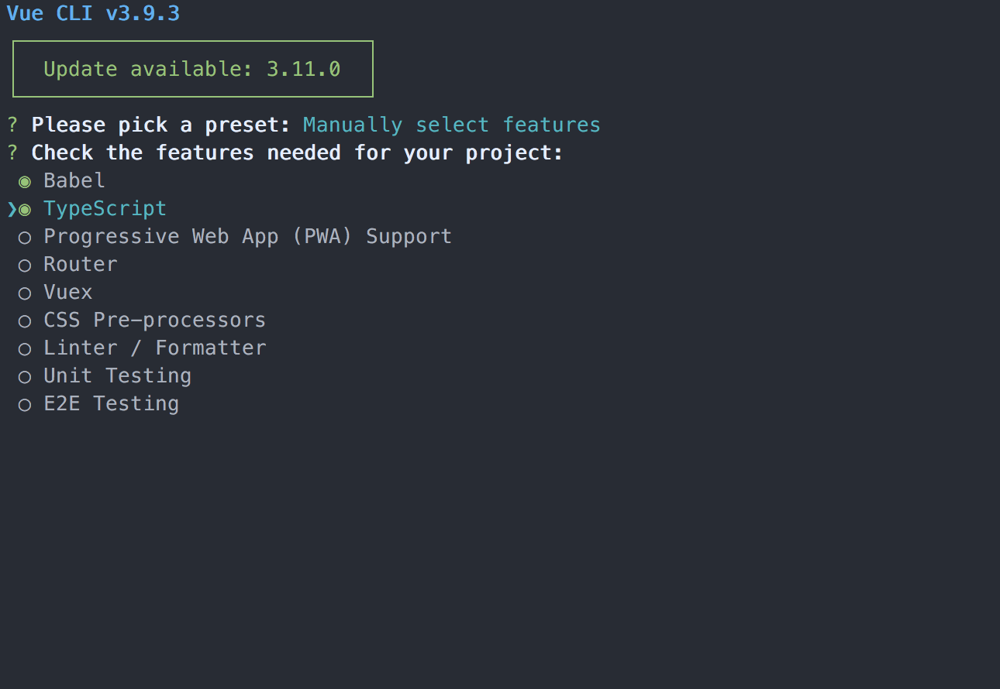
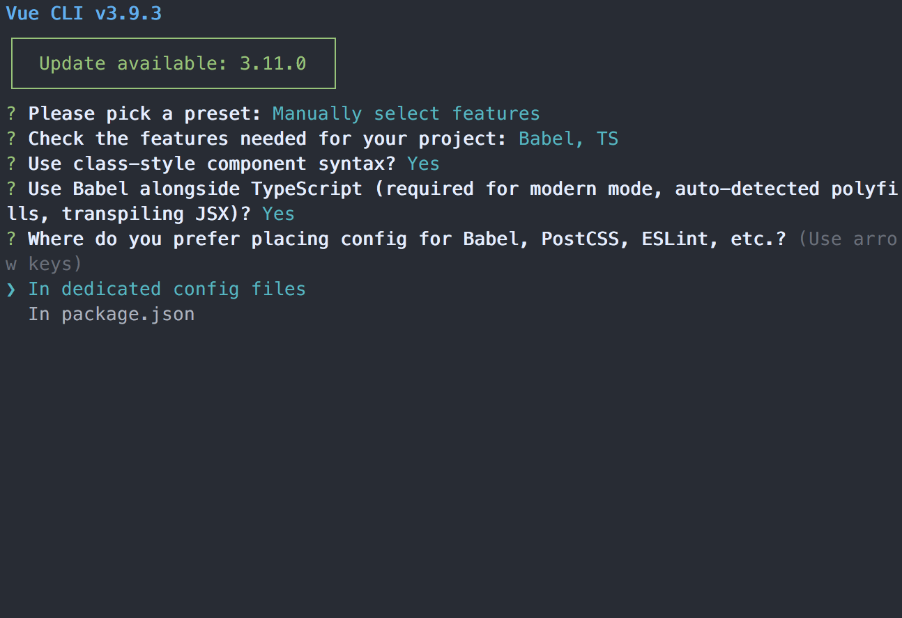

## Getting started

In this tutorial how to make your first Vue app with Typescript.
Make sure you have [node.js](https://nodejs.org/en/download/) and [vue-cli](https://cli.vuejs.org/guide/installation.html) installed.

### Creating app

To create a new project, run:

```bash
vue create name-of-my-app
```

You will be prompted to pick a preset. Choose "Manually select features" to pick the features you need.


From features we pick Babel, Typescript. We also recommend to pick Vuex (for vue-settings), Router (for subpages) and linter (code checker, but it can be very tricky)


After picking features you will be prompted to choose class component or not. We definitelly recommend it as it is very easy to use. Press `Y` for yes


You will then asked if you want to use Babel alongside with Typescript press `Y` for yes.
We also prefer to place config in dedicated files. It makes code more cleaner


After installation just change directory with
```bash
cd name-of-my-app
```

and run with

```
yarn serve
```


